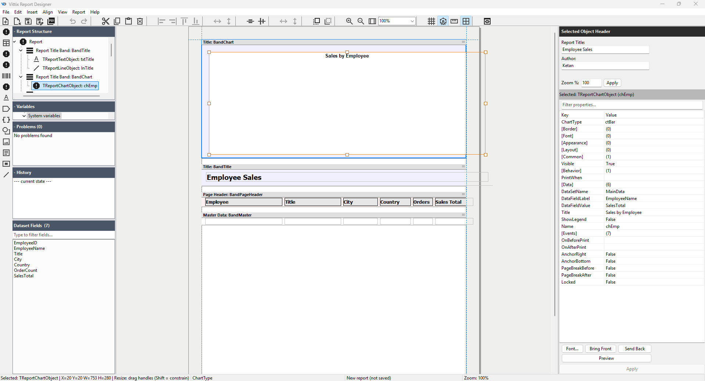

<div align="center">
  <h1>VittixReport</h1>
  <p><b>A modern reporting framework and standalone visual designer for Delphi VCL applications.</b></p>
</div>

VittixReport is a comprehensive reporting suite built entirely from the ground up for Delphi. It provides developers with a robust runtime engine, a band-oriented report model, and a full-featured visual designer. 

Unlike legacy reporting tools, the VittixReport runtime relies on the standard Delphi RTL and VCL plus one vendored, MIT-licensed QR-code library (`source/ThirdParty/QRCodeGenLib`). Reports are serialized into a clean, source-control-friendly JSON format (`.vrt`).

<div align="center">
  
  <br>
  <sub>The standalone visual designer — structure tree, dataset fields, design canvas and property inspector, with a sample report open.</sub>
</div>

## Features

* **🎨 Standalone Visual Designer:** A powerful desktop application featuring drag-and-drop object placement, a property inspector, band management, and a live print preview.
* **⚡ Self-Contained Core:** The core runtime is the standard Delphi 12.2 RTL and VCL plus the vendored, MIT-licensed QR-code generator library (`source/ThirdParty/QRCodeGenLib`) — no external component packs to install. *(Note: the standalone visual designer application additionally requires madExcept and uses the FireDAC/ADO data-access components that ship with RAD Studio; its SVG-sourced icons are compiled to PNG resources, so no external SVG component library is needed.)*
* **🔄 Unlimited Undo/Redo:** The designer implements a deep undo/redo stack for *every* action, including complex multi-object alignments, property changes, and band management.
* **📄 JSON Report Format (`.vrt`):** Say goodbye to binary blobs. Reports are stored in a human-readable, easily diffable JSON format.
* **🧩 Rich Object Library:** Out-of-the-box support for text labels, data fields, rich text, images, shapes, lines, barcodes, tables, and nested sub-reports.
* **🚀 Runtime Event Scripting:** Hook into the engine's rendering pipeline with `OnBeforePrint` / `OnAfterPrint` events at both the band and object level, driven by your host application's Delphi code.
* **📊 Band-Oriented Layout:** Supports standard structural bands including Report Title, Page Header/Footer, Master Data (with runtime `TDataSet` binding), and Report Summary.
* **🖨️ Print & Export:** Built-in **Vector PDF** export (the default — no printer driver required), a printer-based PDF compatibility path, and native system printing capabilities.

## Project Structure

* `source/` — The core framework (engine, object model, serializer, components, and designer UI controls).
* `vittixdesigner/` — The standalone Windows report designer application.
* `packages/` — Delphi runtime and design-time package files (`.dpk`).
* `docs/` — Additional technical documentation (e.g., Event Scripting Rules).

## Requirements
* Delphi 12.2 or later
* VCL application target
* Windows 10 or later
* Win32 or Win64 target platform

*The default Vector PDF export needs no printer driver. The printer-based compatibility path requires the Windows printing system, such as Microsoft Print to PDF.*

## Getting Started

### Building the Standalone Designer

1. Open the project: `vittixdesigner/VittixDesigner.dproj`
2. Build the project in Delphi.
3. Run the designer.

Use the designer to:
* Create reports
* Add bands
* Place report objects
* Bind fields
* Edit properties
* Preview reports
* Save `.vrt` files

### Using the Runtime Components
To use VittixReport in your own Delphi VCL application:

1. Add the `source/` folder to your Delphi library/search path.
2. Install the runtime/design-time packages from `packages/`, if required.
3. Load a `.vrt` report file using `TReportSerializer`.
4. Attach your dataset.
5. Prepare and preview, print, or export the report.

### Example: Export a Report to PDF

The default PDF export is the native **Vector PDF** writer (no printer driver
required, silent/server capable).  The printer-based exporter is retained as a
compatibility path.

```delphi
uses
  Vittix.Report.Model,
  Vittix.Report.Engine,
  Vittix.Report.Serializer,
  Vittix.Report.Export.Commands,
  Vittix.Report.Export.VectorPDF;

procedure GenerateInvoicePDF;
var
  Report: TReportModel;
  Engine: TReportEngine;
  ExportDoc: TReportExportDocument;
begin
  Report := TReportSerializer.LoadFromFile('C:\Reports\Invoice.vrt');
  ExportDoc := TReportExportDocument.Create;
  try
    Engine := TReportEngine.Create(Report, qryInvoiceData);
    try
      Engine.ExportDocument := ExportDoc;
      Engine.Prepare;

      TReportVectorPDFExporter.ExportDocument(
        ExportDoc,
        'C:\Output\Invoice_001.pdf'
      );
    finally
      Engine.Free;
    end;
  finally
    ExportDoc.Free;
    Report.Free;
  end;
end;
```

On the `TVittixReport` component the same is `ExportToPDF(...)`; the
printer-based compatibility path is `ExportToPrinterPDF(...)`.

## File Format
- Reports are saved as JSON (`.vrt`). See `Vittix.Report.Serializer` for details.

## License
See [LICENSE](LICENSE).

## Documentation
- See `USER_MANUAL.md` for end-user instructions
- See `DEVELOPER_MANUAL.md` for developer integration and extension
